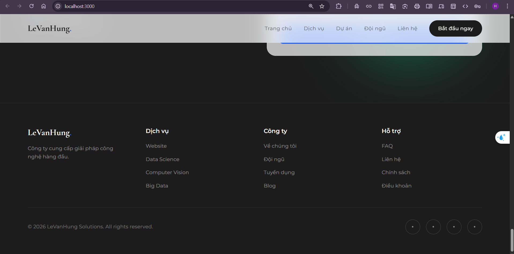

# React-Tailwind-Clickstream




### 1️⃣ Cài đặt dependencies
```bash
npm install
```
### 2️⃣ Chạy Development (React + Server cùng lúc)
```bash
npm run dev
```
### 3️⃣ Hoặc chạy riêng:
```bash
# Terminal 1: React app (port 3000)
npm start
# Terminal 2: Server logging (port 8080)
npm run server
```
### 4️⃣ Mở trình duyệt:
```
http://localhost:3000         → Website chính
http://localhost:8080/logs-viewer.html  → Dashboard xem logs
